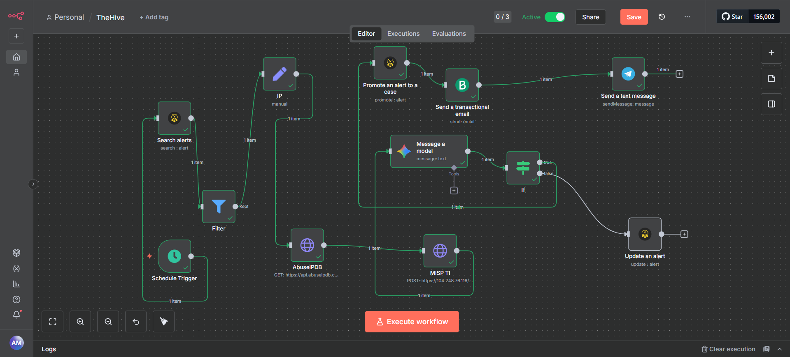
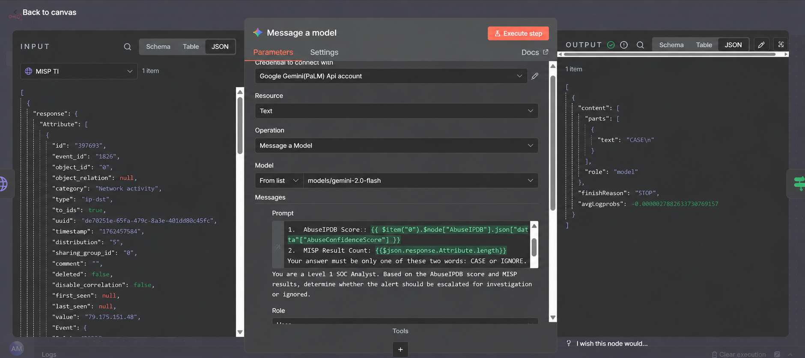
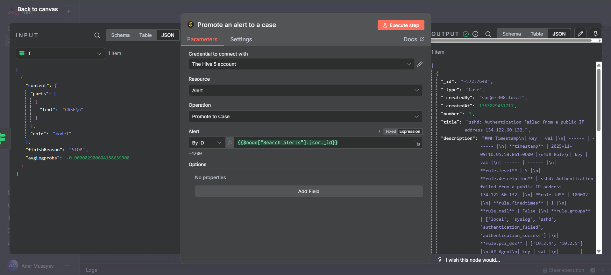

# Enterprise SOC & Automated Threat Response Architecture (SOAR)

## 📌 Project Overview
This is a full self-hosted SOAR playbook designed to automate Level 1 SOC workflows. Running on Debian, this architecture can ingest Wazuh alerts, enrich them with threat intelligence, utilize Gemini AI for triage, and promote validated threats to TheHive while alerting SOC team members. This automated approach reduces alert fatigue and minimizes Incident Response times.

## 🏗 Full Architecture & Workflow

### 1. Ingestion & Filtering
A schedule node on n8n regularly pulls new alerts from TheHive 5 (which is integrated with Wazuh) and filters any already processed alerts before they enter the pipeline. Only new security events such as 'sshd: Authentication failed from a public IP' will be piped down to the next stage.

### 2. Extraction & Threat Intel Enrichment
When a critical alert is observed, the alert description will be parsed for any IOCs, specifically the attacker's IP. The IP is then looked up on two threat intelligence platforms:
* **AbuseIPDB:** (for global abuse confidence score)
* **MISP:** (for any previously discovered local or community threats associated with the IP).

### 3. AI Triage (Gemini 2.0 Flash)
All enriched data points from the above stages will be passed to Google Gemini through a specialized prompt that assigns the AI the role of an L1 SOC analyst to categorize the threat based on whether it is CASE (High-Risk) or IGNORE (Low-Risk), considering both the AbuseIPDB score and the number of threat events on MISP.

### 4. High-Risk vs. Low-Risk Routing
The alert is then routed to one of two different paths depending on whether it was classified as CASE or IGNORE:
* **False Path (Low-Risk):** If classified as a low-risk false positive, the alert is closed on TheHive and labeled as 'n8n_low_priority' to save SOC effort.
* **True Path (High-Risk):** If classified as a high-risk threat, a 'Case' will be automatically created on TheHive which will include all enriched indicators for the Blue team's investigation.

### 5. Multi-Channel Notifications
To promptly inform the SOC team of high-risk cases, multiple communication channels are used:
* **Telegram Bot API:** An alert is sent directly to the team's secure chat.
* **Transactional Email (Brevo):** A rich HTML email is sent with the detailed information regarding the alert using a custom domain (`info@projectcyber.online`) to maintain official records.

## 🛠 Technologies Used
* **SIEM / Endpoint Security:** Wazuh
* **Incident Response Platform:** TheHive 5
* **Automation Engine:** n8n (Self-hosted on Debian)
* **Threat Intelligence:** AbuseIPDB API, Custom MISP Instance
* **AI Engine:** Google Gemini 2.0 Flash API
* **Notifications:** Telegram API, Brevo SMTP (`info@projectcyber.online`)

## 🚀 Deployment & Security Considerations
* All private details (API Keys, local IPs, Telegram Chat IDs) are hidden for the sake of public demonstration.
* Import `workflow.json` into your n8n instance and replace all placeholders (`<PLACEHOLDERS>`) with your API Keys and relevant credentials to test.

## 👤 Author
**Anar Musayev**
* [GitHub Profile](https://github.com/Musa3w)
* [LinkedIn Profile](https://www.linkedin.com/in/anarmusayev-/)
