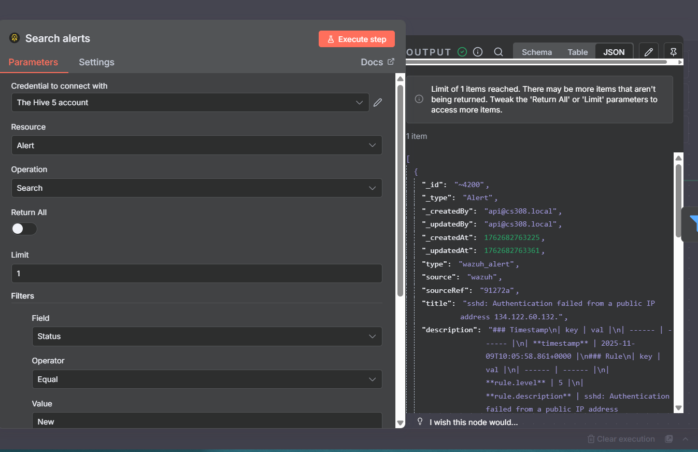
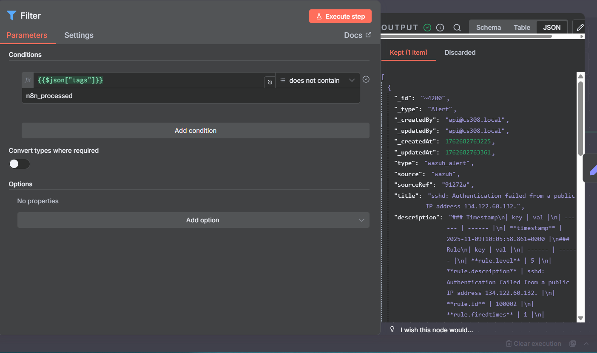
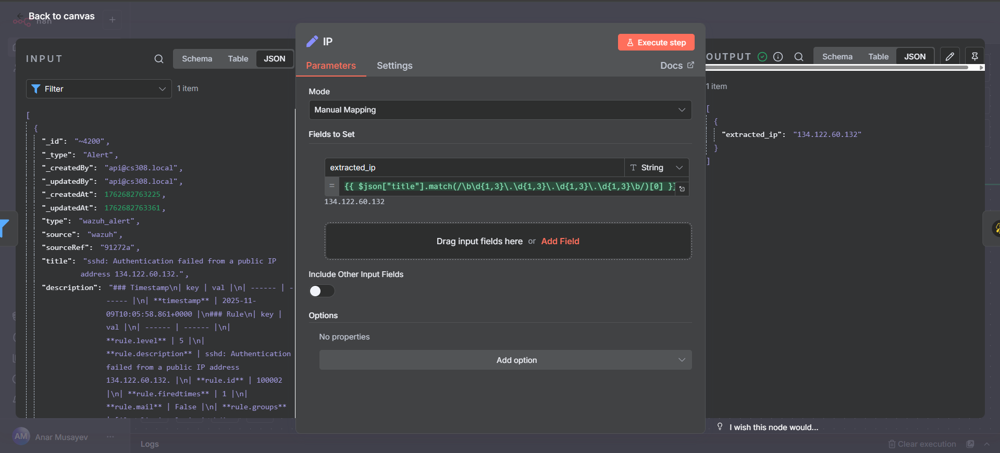
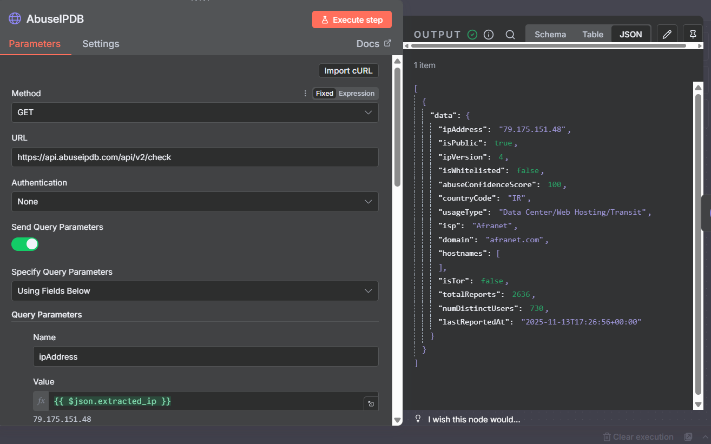
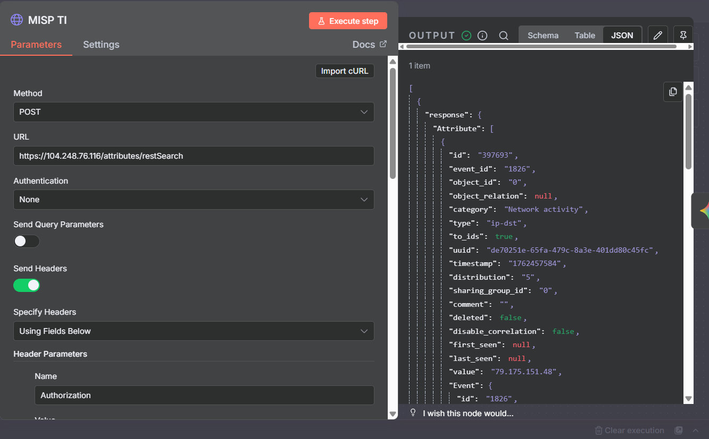
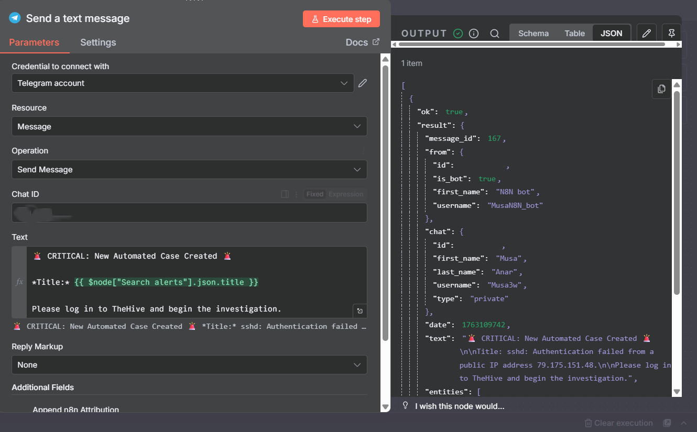
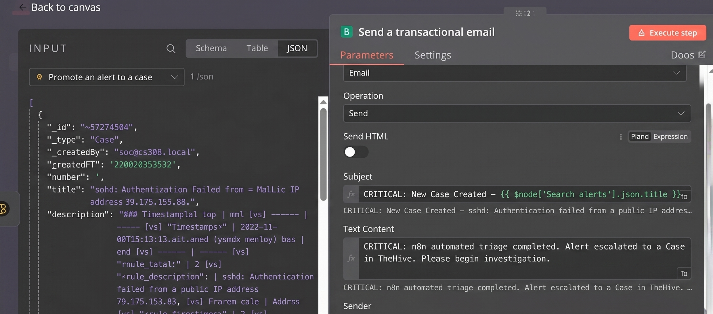
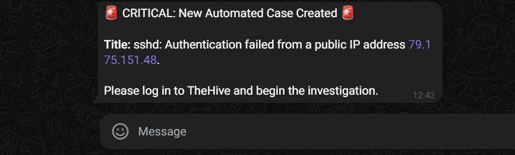
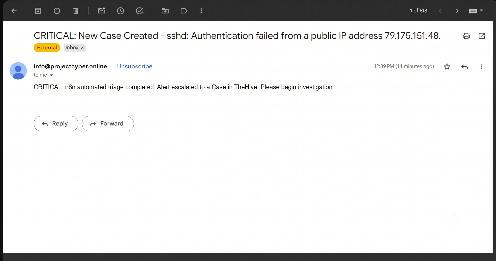

# Enterprise SOC & Automated Threat Response Architecture (SOAR)

## 📌 Project Overview
This is a full self-hosted SOAR playbook designed to automate Level 1 SOC workflows. Running on Debian, this architecture can ingest Wazuh alerts, enrich them with threat intelligence, utilize Gemini AI for triage, and promote validated threats to TheHive while alerting SOC team members. This automated approach reduces alert fatigue and minimizes Incident Response times.

## 🏗 Full Architecture & Workflow

### 1. Ingestion & Filtering
A schedule node on n8n regularly pulls new alerts from TheHive 5 (which is integrated with Wazuh) and filters any already processed alerts before they enter the pipeline. Only new security events such as 'sshd: Authentication failed from a public IP' will be piped down to the next stage.

**Step 1: Fetching New Alerts**

**Step 2: Filtering Processed Alerts**

### 2. Extraction & Threat Intel Enrichment
When a critical alert is observed, the alert description will be parsed for any IOCs, specifically the attacker's IP. The IP is then looked up on two threat intelligence platforms:

**Step 1: IP Extraction**
The attacker's IP address is safely extracted from the raw alert data using a manual mapping node.

**Step 2: AbuseIPDB Check**
The extracted IP is queried against AbuseIPDB via API to retrieve the global abuse confidence score.

**Step 3: MISP Threat Intel**
Simultaneously, the IP is searched in a custom MISP instance (Malware Information Sharing Platform) to check for any previously discovered local or community-shared threats.

### 3. AI Triage (Gemini 2.0 Flash)
All enriched data points from the above stages will be passed to Google Gemini through a specialized prompt that assigns the AI the role of an L1 SOC analyst to categorize the threat based on whether it is CASE (High-Risk) or IGNORE (Low-Risk), considering both the AbuseIPDB score and the number of threat events on MISP.

### 4. High-Risk vs. Low-Risk Routing
The alert is then routed to one of two different paths depending on whether it was classified as CASE or IGNORE:
* **False Path (Low-Risk):** If classified as a low-risk false positive, the alert is closed on TheHive and labeled as 'n8n_low_priority' to save SOC effort.
* **True Path (High-Risk):** If classified as a high-risk threat, a 'Case' will be automatically created on TheHive which will include all enriched indicators for the Blue team's investigation.

### 5. Multi-Channel Notifications
To promptly inform the SOC team of high-risk cases, multiple communication channels are configured within the workflow:

**Step 1: Telegram Bot API Configuration**
An alert is formatted and sent directly to the team's secure chat.

**Step 2: Transactional Email (Brevo) Configuration**
A rich HTML email is prepared to be sent via a custom domain (`info@projectcyber.online`) to maintain official records.

### 6. Proof of Success
The automated workflow successfully executes and delivers real-time, actionable alerts to the assigned SOC channels:

**Telegram Alert Delivered:**

**Email Notification Delivered:**

## 🛠 Technologies Used
* **SIEM / Endpoint Security:** Wazuh
* **Incident Response Platform:** TheHive 5
* **Automation Engine:** n8n (Self-hosted on Debian)
* **Threat Intelligence:** AbuseIPDB API, Custom MISP Instance
* **AI Engine:** Google Gemini 2.0 Flash API
* **Notifications:** Telegram API, Brevo SMTP (`info@projectcyber.online`)

## 🚀 System Implementation Guidelines
Since this workflow contains sensitive API integrations, the source JSON has been excluded from this public repository for security purposes. To implement this architecture in your own environment:

1. **Environment Setup:** Deploy a self-hosted **n8n** instance on a Debian-based server.
2. **Connectivity:** Configure secure communication channels between **Wazuh** (SIEM) and **TheHive** (Incident Response).
3. **API Integration:** Within n8n, create dedicated nodes for:
    * **Threat Intel:** Set up HTTP Request nodes for AbuseIPDB and MISP REST API endpoints.
    * **AI Triage:** Configure the Google Gemini API node with a "SOC Analyst" system prompt.
    * **Notifications:** Define your custom Telegram Bot and SMTP (Brevo) credentials.
4. **Logic Routing:** Utilize n8n’s `If` and `Filter` nodes to implement the high-risk vs. low-risk routing logic based on your specific security thresholds.

*This modular approach allows for rapid scaling and customization according to your organization's specific threat landscape.*

## 👤 Author
**Anar Musayev**
* [GitHub Profile](https://github.com/Musa3w)
* [LinkedIn Profile](https://www.linkedin.com/in/anarmusayev-/)
